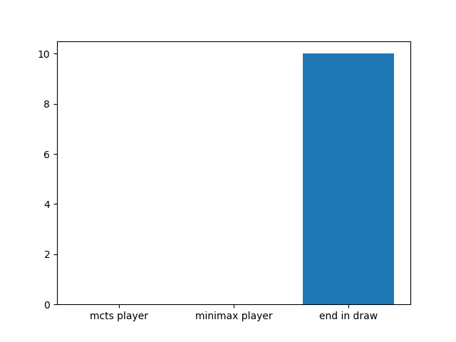
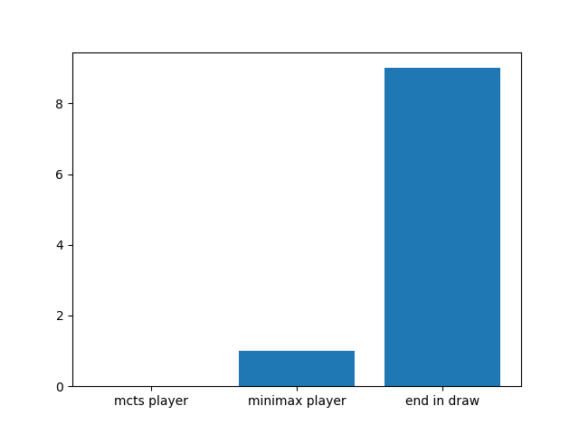

# 项目说明

> 这是一个使用python实现的``Minimax(alpha-beta)搜索``和``蒙特卡洛树搜索``在tictactoe游戏上PK的项目,
这里主要是利用了我之前写的[Minimax](https://github.com/zhuliquan/tictactoe_minimax)和
[蒙特卡洛搜索树](https://github.com/zhuliquan/tictactoe_mcts)的例子

## 文件说明

项目中有四个文件
- game.py 
- minimax.py
- mcts.py 
- analyze_pk.py
---
>这里面需要说明的是anaysis_pk.py, 这里面包含两种AI的博弈代码，
这里面我是进行了10次博弈模拟，蒙特卡洛树搜索自身每次下棋都是经过了
200次模拟，然后将结果以图像的形式展现

## 运行程序
如果你想运行程序查看博弈结果，你可以运行anaysis_pk.py这个文件。
```
python analyze_pk.py
```

### 运行结果
经过若干次的程序运行，发现了MiniMax搜索基本上处于不败的地位，而蒙特卡洛树搜索在一开始
由于搜索树还没有完全构建可能处于下风，但是之后也可以和MinimMax打平。所以总体来说
MiniMax是优于蒙特卡洛树搜索，但是MiniMax即使经过了Alpha-Beta剪枝，运行时间上还是
蒙特卡洛搜索树上占有，由于由节点维持数据，蒙特卡洛搜索树可以反复利用已经有的结果，
同时也更加耗时。下面是两个运行结果展示
<div>
<p>图1是表示两者完全可以打平情况</p>

</div>
<div>
<p>图2是表示Minimax还有可能胜出的情况</p>

</div>

## 运行条件
- python 3.6.5
- numpy 1.13.3
- pandas 0.22.0
- matplotlib 2.1.0
